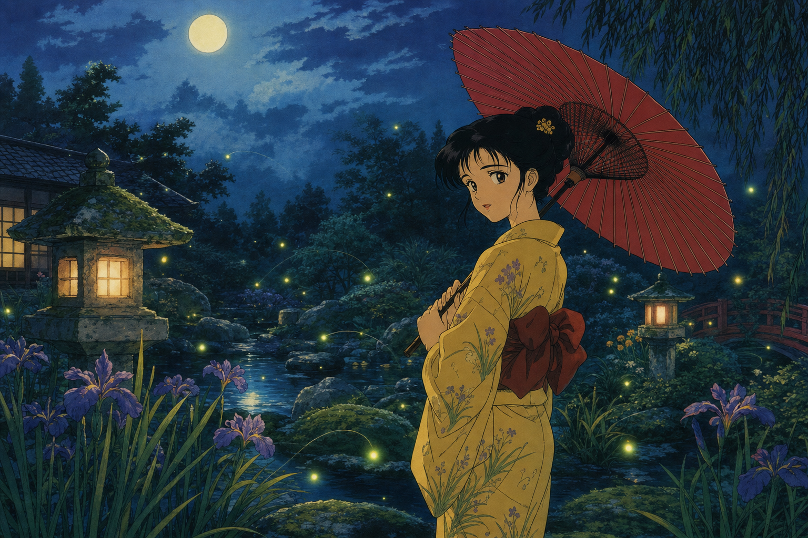

# opencode-gpt-imagegen

> Bring **GPT image generation** to [OpenCode](https://opencode.ai). Use it through your **ChatGPT subscription** (no API costs!) or through the **OpenAI API** — your call.

| Auth path | Status | Billing |
|---|---|---|
| **ChatGPT subscription** (OAuth) | **Available now in v0.1.0** | **No extra cost** — comes out of your existing Plus / Pro / Business plan |
| **OpenAI API key** | **Coming soon in v0.2.0** | Pay-per-image against your API credits, with `generate` + `edit` support |

## Highlights

- **Subscription-friendly.** Generations ride on the same Codex backend channel OpenCode already uses for ChatGPT subscription chat — billed against your ChatGPT plan, not your API credits.
- **Reference images.** Pass any number of input images alongside the prompt for style guidance, edit targets, or compositing inputs.

## Installation

*Installation instructions are coming with the upcoming npm release. Stay tuned.*

## Usage

Just ask your agent in natural language and `gpt_image_gen` will be picked up.

The three examples below are the **actual outputs of this repo's e2e test suite** — see [`tests/e2e.test.ts`](./tests/e2e.test.ts) for the exact prompts and assertions.

### Example A — generate

> Draw a man in a navy samue with a red hachimaki, standing in a garden full of cherry blossoms. 90s anime style. Save it as `character.png`, portrait 1024x1536.

### Example B — auto-versioning

`gpt_image_gen` never overwrites an existing file: when the `out` path is already taken, it picks `-v2`, `-v3`, … instead.

> Now do the same path but make it a woman in a yellow yukata holding a red wagasa, in a moonlit garden with fireflies. Landscape 1536x1024.

The previous `character.png` is left untouched; the new image lands at `character-v2.png`.

### Example C — feed existing image files as input

Pass any number of image paths via the `images` argument and the model uses them as references for the next generation — for style guidance, characters to keep, scenes to extend, and so on.

> Take `character.png` and `character-v2.png` and put both characters together on the engawa of an old Japanese house, smiling at the viewer. 2048x1152, same 90s anime style.

## Roadmap

| Version | Auth path | Scope | Status |
|---|---|---|---|
| **v0.1.0** | ChatGPT subscription | `gpt_image_gen` with optional reference images (generation + reference-guided edits via prompting) | **Released** |
| **v0.2.0** | OpenAI API key | Adds the API-key billing path: both `generate` (`/v1/images/generations`) and `edit` (`/v1/images/edits`) with reference images | Next |
| **v0.3.0** | OpenAI API key | Adds **pixel-precise mask inpainting** via `/v1/images/edits` (binary PNG alpha mask) | Planned |

## How it works

OpenCode already talks to the OpenAI Codex backend to power ChatGPT subscription chat. This plugin reuses that same endpoint, attaching the hosted `image_generation` tool to a single-turn request, then writes the returned PNG to disk. Auth is read from OpenCode's standard `auth.json`; no new credential surface is introduced.

## Disclaimer

This is an **unofficial, third-party** plugin, not affiliated with or endorsed by OpenAI or OpenCode.

It uses the same Codex backend endpoint OpenCode itself calls for ChatGPT subscription chat — this plugin just adds the hosted `image_generation` tool to that conversation. Use must comply with OpenAI's [Terms of Use](https://openai.com/policies/row-terms-of-use/) and [Usage Policies](https://openai.com/policies/usage-policies/).
