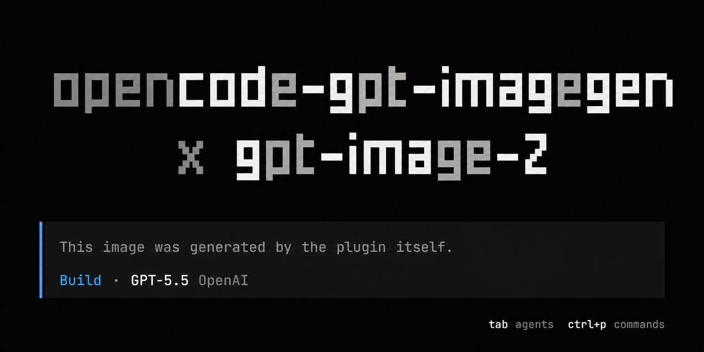

# opencode-gpt-imagegen

> **⚠️ ChatGPT subscription users: update before October 14, 2026.** [GPT-5.5 will retire from Codex with ChatGPT sign-in](https://learn.chatgpt.com/docs/models#gpt-55-retirement). Plugin versions before `0.1.13` use GPT-5.5 and will stop generating images. Follow the [update steps](#updating-the-plugin) to install `0.1.13` or later.

<p align="center"></p>

> Bring [**ChatGPT Images 2.0**](https://openai.com/index/introducing-chatgpt-images-2-0/) (`gpt-image-2`) to [OpenCode](https://opencode.ai). Use it through your **ChatGPT subscription** (no API costs!) or through the **OpenAI API** — your call.

[](https://opencode.ai/v2/docs/build/plugins)
[](https://www.npmjs.com/package/opencode-gpt-imagegen)
[](https://github.com/yuji-hatakeyama/opencode-gpt-imagegen/actions/workflows/ci.yml)
[](./LICENSE)

| Auth path | Status | Billing |
|---|---|---|
| **ChatGPT subscription** (OAuth) | **Available now in v0.1.0** | **No extra cost** — comes out of your existing Plus / Pro / Business plan |
| **OpenAI API key** | **Coming soon in v0.2.0** | Pay-per-image against your API credits, with `generate` + `edit` support |

## Highlights

- **Subscription-friendly.** Generations ride on the same Codex backend channel OpenCode already uses for ChatGPT subscription chat — billed against your ChatGPT plan, not your API credits.
- **Reference images.** Pass any number of input images alongside the prompt for style guidance, edit targets, or compositing inputs.

## Installation

The plugin supports **OpenCode V2** and **OpenCode V1 1.18.29+** through separate entrypoints in the same package. Add it to your [OpenCode V2 config](https://opencode.ai/v2/docs/plugins). For example, in `opencode.json`:

```json
{
  "$schema": "https://opencode.ai/config.json",
  "plugins": ["opencode-gpt-imagegen"]
}
```

For **OpenCode V1**, use `"plugin"` (singular) instead of `"plugins"`.

OpenCode auto-installs the package via Bun on next launch — no separate `npm install` step is needed. The plugin requires ChatGPT subscription credentials for the **Codex backend**.

### Authentication in OpenCode V2

Connect the **OpenAI** integration using **Codex browser (legacy)** or **Codex device code (legacy)** and select that connection as active. V2 provides credentials through its integration API, including token refresh and the selected account; the plugin does not read the old `auth.json` or use `OPENCODE_AUTH_CONTENT` on this path.

The newer **Sign in with ChatGPT** / token-sharing method targets the standard OpenAI API, not the Codex backend used by this plugin. It is not supported by this subscription path; selecting it produces an error explaining which Codex connection to use. An API-key connection is also not supported yet.

### Using a local checkout

Build the plugin with `bun install --frozen-lockfile` followed by `bun run build`. In your V2 config, replace the package name with the checkout's absolute directory path:

```json
{
  "$schema": "https://opencode.ai/config.json",
  "plugins": ["/absolute/path/to/opencode-gpt-imagegen"]
}
```

### Updating the plugin

In **OpenCode V2**, run `opencode plugin update opencode-gpt-imagegen` for an unpinned global package plugin. Exact versions and local checkouts are skipped; update an exact config entry explicitly, or rebuild a local checkout with `bun run build`. Restart the service if local dependency changes are not picked up. See [OpenCode's plugin management guide](https://opencode.ai/v2/docs/plugins#manage).

For **OpenCode V1**, use the cache-based steps below:

OpenCode caches npm plugins, so restarting it may keep an older version. To update this plugin:

1. Check the `plugins` entry (`plugin` in V1) in your OpenCode config. Use `"opencode-gpt-imagegen"` or `"opencode-gpt-imagegen@latest"` to request the latest version. If you pinned a version, remove the version suffix or change it to the version you want to install.
2. Quit OpenCode completely.
3. If your entry is unversioned or uses `@latest`, delete the cached directory `~/.cache/opencode/packages/opencode-gpt-imagegen@latest/`.
4. Restart OpenCode to install the requested version.

If you use an unversioned entry or `@latest` but do not have that directory, see [OpenCode's cache-clearing instructions](https://opencode.ai/docs/troubleshooting/#clear-the-cache) for other cache layouts.

## Usage

Just ask your agent in natural language and `gpt_imagegen` will be picked up.

The three examples below are the **actual outputs of this repo's e2e test suite** — see [`tests/e2e/subscription.test.ts`](./tests/e2e/subscription.test.ts) for the exact prompts and assertions.

### Example A — generate

> Draw a man in a navy samue with a red hachimaki, standing in a garden full of cherry blossoms. 90s anime style. Save it as `character.png`, portrait 1024x1536.

<p align="center"></p>

### Example B — auto-versioning

`gpt_imagegen` never overwrites an existing file: when the `out` path is already taken, it picks `-v2`, `-v3`, … instead.

> Now do the same path but make it a woman in a yellow yukata holding a red wagasa, in a moonlit garden with fireflies. Landscape 1536x1024.

The previous `character.png` is left untouched; the new image lands at `character-v2.png`.

<p align="center"></p>

### Example C — feed existing image files as input

Pass any number of image paths via the `images` argument and the model uses them as references for the next generation — for style guidance, characters to keep, scenes to extend, and so on.

> Take `character.png` and `character-v2.png` and put both characters together on the engawa of an old Japanese house, smiling at the viewer. 2048x1152, same 90s anime style.

<p align="center"></p>

## Roadmap

| Version | Auth path | Scope | Status |
|---|---|---|---|
| **v0.1.0** | ChatGPT subscription | `gpt_imagegen` with optional reference images (generation + reference-guided edits via prompting) | **Released** |
| **v0.2.0** | OpenAI API key | Adds the API-key billing path: both `generate` (`/v1/images/generations`) and `edit` (`/v1/images/edits`) with reference images | Next |
| **v0.3.0** | OpenAI API key | Adds **pixel-precise mask inpainting** via `/v1/images/edits` (binary PNG alpha mask) | Planned |

## How it works

This plugin calls the OpenAI Codex backend, attaching the hosted `image_generation` tool to a single-turn request, then writes the returned PNG to disk. V2 registers `gpt_imagegen` through `setup()` and a tool transform with JSON Schema, resolves the invoking session's directory, and returns structured `content` and metadata. Cancellation is forwarded to the backend request.

V2 auth is resolved through OpenCode's active OpenAI integration connection. V1 retains its `server()` entrypoint and reads `OPENCODE_AUTH_CONTENT` or OpenCode's standard `auth.json`; no new credential store is introduced.

### Testing

- `bun run test`: offline unit tests, including V1/V2 entrypoints, V2 credential resolution, reference images, auto-versioning, and cancellation.
- `bun run test:package`: builds and installs a packed production package in a temporary directory, then loads it in Node ESM and exercises both entrypoint contracts with a mocked host and backend. Does not call a model or consume subscription quota; this is not a real OpenCode CLI test.
- `bun run test:e2e_subscription`: real generation through an installed V1 CLI.
- `bun run test:e2e_subscription_v2`: real generation through an installed V2 CLI, with native V2 configuration and a private server. Requires an active Codex OAuth connection and consumes subscription quota.

## Contributing

Small bug fixes are welcome as direct pull requests. For features, refactors, or behavior changes, please open an issue first. See [CONTRIBUTING.md](CONTRIBUTING.md) for details.

## Disclaimer

This is an **unofficial, third-party** plugin, not affiliated with or endorsed by OpenAI or OpenCode.

It uses the same Codex backend endpoint OpenCode itself calls for ChatGPT subscription chat — this plugin just adds the hosted `image_generation` tool to that conversation. Use must comply with OpenAI's [Terms of Use](https://openai.com/policies/row-terms-of-use/) and [Usage Policies](https://openai.com/policies/usage-policies/).

## Star History

<a href="https://www.star-history.com/?repos=yuji-hatakeyama%2Fopencode-gpt-imagegen&type=date&legend=bottom-right">
 <picture>
   <source media="(prefers-color-scheme: dark)" srcset="https://api.star-history.com/chart?repos=yuji-hatakeyama/opencode-gpt-imagegen&type=date&theme=dark&legend=bottom-right" />
   <source media="(prefers-color-scheme: light)" srcset="https://api.star-history.com/chart?repos=yuji-hatakeyama/opencode-gpt-imagegen&type=date&legend=bottom-right" />
   
 </picture>
</a>
